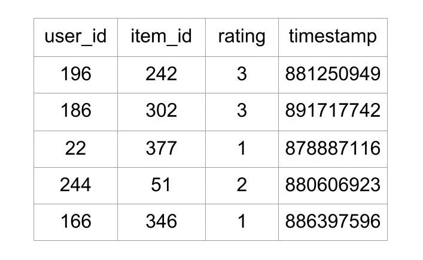
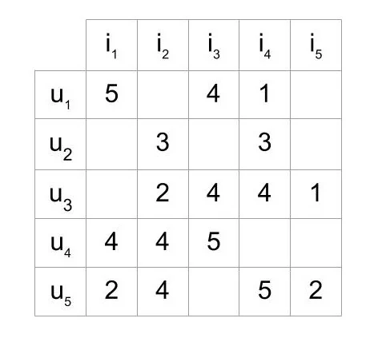
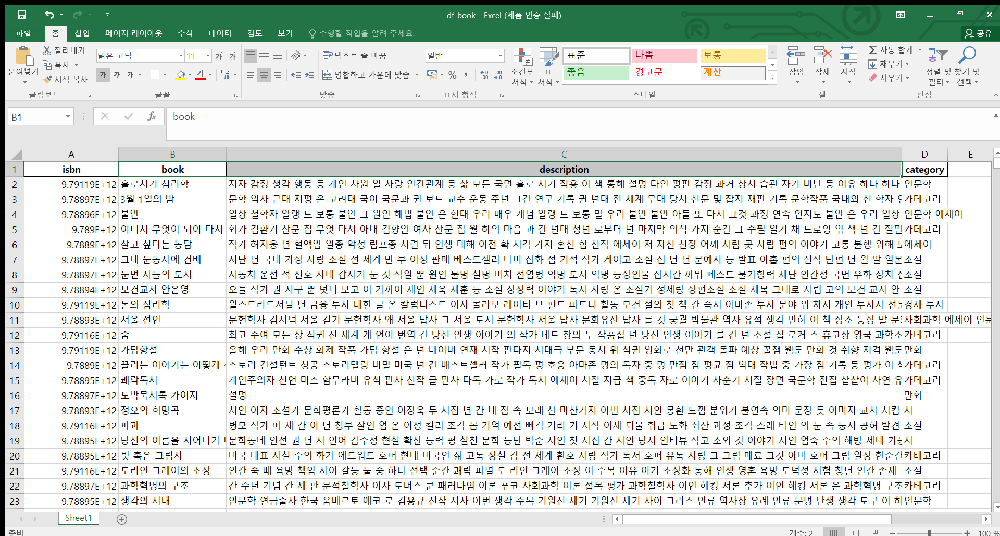
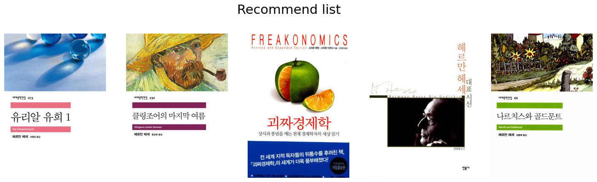
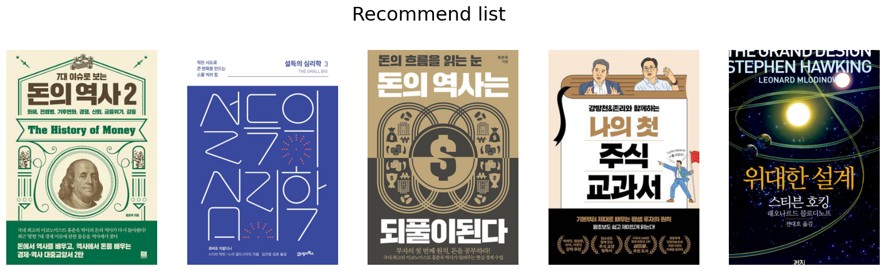
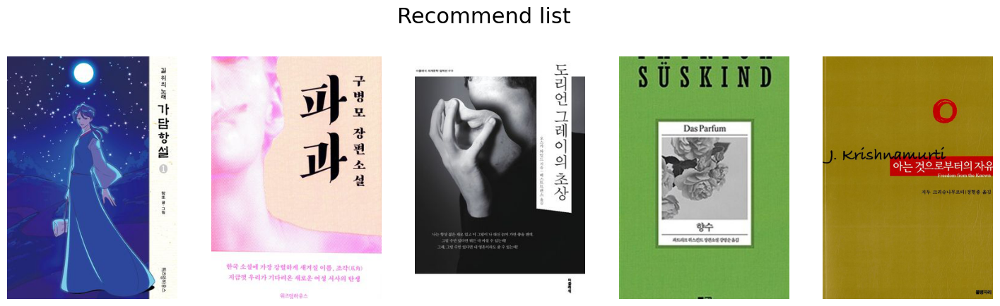
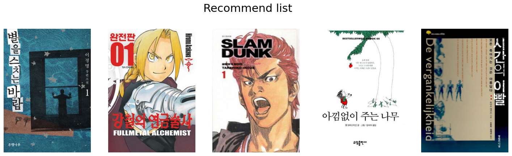
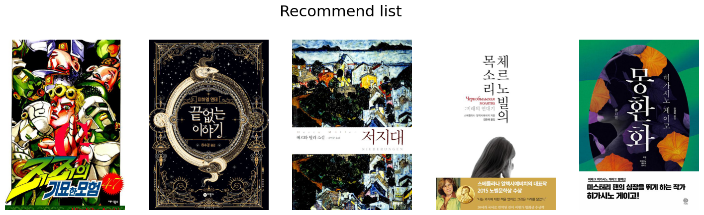
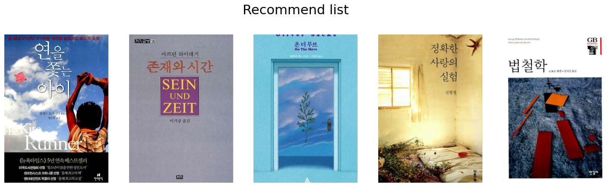

## 북렛에 사용된 추천시스템 2가지

- 협업필터링 with KNN
- 컨텐츠 기반 필터링 with TF-IDF

### 협업필터링이란?

협업 필터링은 사람들의 콘텐츠 사용 패턴을 분석해 추천하는 방법입니다. 즉 유저에게 추천을 해주기 위해, 그 유저와 비슷한 패턴을 보이는 유저 정보를 사용합니다. 구체적인 방법으로는 KNN, MF 등이 있습니다.

KNN 알고리즘은 데이터 간 거리를 기반으로 가장 가까운 이웃들을 찾아 분류나 회귀를 수행하는 알고리즘입니다.
새로운 데이터의 분류나 회귀 값을 예측할 때, 가장 가까운 k개의 이웃 데이터들의 레이블을 확인하여 예측합니다.

### KNN 예시

- 북렛에서는 유저의 리뷰점수 기반으로 협업 필터링을 수행합니다.
- 아래와 같은 모양의 데이터가 필요합니다.
- 유저가 아이템에 몇점을 주었는지 알 수 있는 데이터 입니다.



- 위와 같은 데이터를 기반으로 다음과 같은 행렬을 만들 수 있습니다.
- u는 유저, i는 아이템, 숫자는 유저가 아이템에 매긴 점수입니다.



- 행렬이 만들어지면 유저사이의 유사도를 계산할 수 있습니다.
- u1의 점수 기록은 (5, 0, 4, 1, 0), u2의 점수기록은 (0, 3, 0, 3, 0)
- 두 벡터 사이의 거리를 계산합니다. 거리가 가까울 수록 유사하다고 판단합니다.

- 유저 u5가 아이템 i3에 몇점을 매길지 예측하기위해서 u5의 점수기록을 (2, 4, 5, 2)로 나타냅니다
- 나머지 유저들의 점수기록은 i3항목을 제외하고 다음과 같습니다. (5, 0, 1, 0), (0, 3, 3, 0), (0, 2, 4, 1), (4, 4, 0, 0)
- u5와 나머지 유저들간의 거리를 모두 계산해서 가까운 N명의 유저들을 고릅니다.
- 선택된 N명의 유저들이 아이템 i3에 매긴 점수들을 기반으로 유저 u5가 아이템 i3에 매길 점수를 예측합니다.

### 크롤링으로 수집한 데이터


- 수집한 데이터를 기반으로 새로운 유저가 들어와서 리뷰활동을 하면 추천을 하고 있습니다.
- 구체적인 계산은 scikit-learn surprise라이브러리를 사용했습니다.

## 컨텐츠 기반 필터링이란?

컨텐츠 기반 필터링은 추천 시스템에서 사용되는 기술 중 하나로, 사용자가 이전에 선호한 아이템과 유사한 특성을 가지는 아이템을 추천하는 방법입니다. 이는 아이템 자체의 특성을 기반으로 추천을 수행하기 때문에, 사용자의 이전 행동이나 다른 사용자의 데이터가 필요하지 않습니다.

컨텐츠 기반 필터링은 아이템의 특성을 추출하여 아이템 간의 유사도를 계산하는 과정을 거칩니다. 이후 사용자가 이전에 선호한 아이템과 유사한 특성을 가지는 아이템을 추천합니다. 예를 들어, 영화 추천 시스템에서는 영화의 장르, 감독, 배우 등의 정보를 이용하여 유사도를 계산합니다.

TF-IDF란 특정 문서에서 특정 단어의 중요도를 측정하는 방식입니다.
각 단어의 빈도수(TF)와 해당 단어가 등장하는 문서의 수에 반비례하는 가중치(IDF)를 곱하여 측정합니다.

- 컨텐츠 기반 추천은 아이템 자체의 특성을 분석합니다.
- 그리하여 특성이 비슷한 아이템을 찾습니다.
- 북렛에서는 책의 여러가지 특성중에서 'description'을 사용했습니다.

### 책과 책의 유사도를 측정하는 방법 예시

[
'This is the first document.',
'This is the second second document.',
'And the third one.',
'Is this the first document?',
]

- 위와 같이 문장 4개가 있습니다.
- 4개의 문장에 등장하는 모든 단어들은 아래와 같습니다.

['and', 'document', 'first', 'is', 'one', 'second', 'the','third', 'this']

문장마다 각 단어가 문장속에 몇번 등장하는지 나타낼 수 있습니다.

- 첫번째 문장 벡터 [0, 1, 1, 1, 0, 0, 1, 0, 1]
- 두번째 문장 벡터 [0, 1, 0, 1, 0, 2, 1, 0, 1]
- 세번째 문장 벡터 [1, 0, 0, 0, 1, 0, 1, 1, 0]
- 네번째 문장 벡터 [0, 1, 1, 1, 0, 0, 1, 0, 1]

여기까지만 계산해도 문장사이의 유사도를 계산할 수 있습니다.

### TF-IDF 예시

- 문서가 여러개 있다고 해봅시다.
- 어떤 단어가 여러번 등장하면서도 단 하나의 문서에만 나타날때, 그 단어는 그 문서의 핵심단어입니다.
- 이런 가정을 가지고 단어의 빈도수(TF)와 단어가 등장한 문서의 수의 역수(IDF)를 계산합니다.

- 단어가 3개있고, 문서가 6개, 그리고 각 문서에서 각 단어가 나타난 빈도수를 다음과 같이 표현했습니다.

```python
[3, 0, 1]
[2, 0, 0]
[3, 0, 0]
[4, 0, 0]
[3, 2, 0]
[3, 0, 2]
```

- 이를 기반으로 각 단어마다 tf-idf 점수를 계산하면 다음과 같습니다.

```python
[0.81940995, 0.        , 0.57320793]
[1.        , 0.        , 0.        ]
[1.        , 0.        , 0.        ]
[1.        , 0.        , 0.        ]
[0.47330339, 0.88089948, 0.        ]
[0.58149261, 0.        , 0.81355169]
```

- 그리고 다시 문서 사이의 유사도를 계산할 수 있습니다.

### 도서의 description 데이터



- 위와 같은 데이터를 가지고 구체적인 계산은 scikit-learn surprise 라이브러리를 사용했습니다.

## 데이터 출처

- 알라딘 API
- 책의 상세정보들


- 왓챠피디아 크롤링
- 유저들이 평가한 별점 정보


- 도서관 정보나루
- 나이,성별에 따른 인기대출 도서 정보


## 콘텐츠 기반 추천 결과

### '데미안' 입력 결과

```python
content('데미안')
```



### '돈의 심리학' 입력 결과

```python
content('돈의 심리학')
```



### '7년의 밤' 입력 결과

```python
content('7년의 밤')
```


### '사피엔스' 입력 결과

```python
content('사피엔스')
```


## 협업 필터링 추천 결과물

### 유저 '흰둥이'

```python
KNN('흰둥이')
```

    Computing the cosine similarity matrix...
    Done computing similarity matrix.



### 유저 '희연희'

```python
KNN('희연희')
```

    Computing the cosine similarity matrix...
    Done computing similarity matrix.



### 유저 '김승준'

```python
KNN('김승준')
```

    Computing the cosine similarity matrix...
    Done computing similarity matrix.


### 유저 '똥멍청이'

```python
KNN('똥멍청이')
```

    Computing the cosine similarity matrix...
    Done computing similarity matrix.



### 유저 '샌샌'

```python
KNN('샌샌')
```

    Computing the cosine similarity matrix...
    Done computing similarity matrix.


### 유저 '레몬메론'

```python
KNN('레몬메론')
```

    Computing the cosine similarity matrix...
    Done computing similarity matrix.



```python

```
