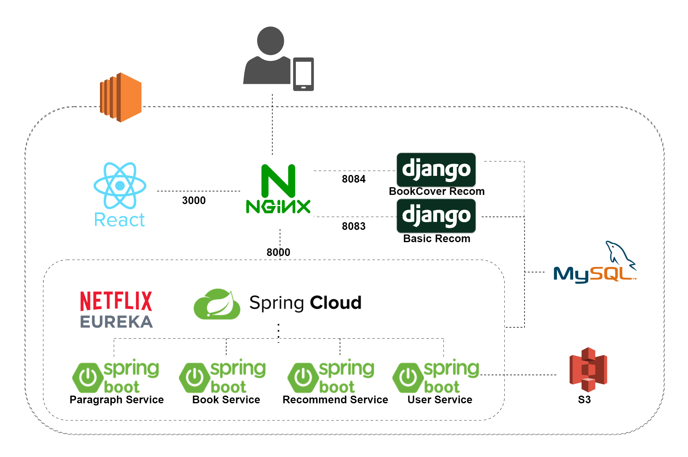
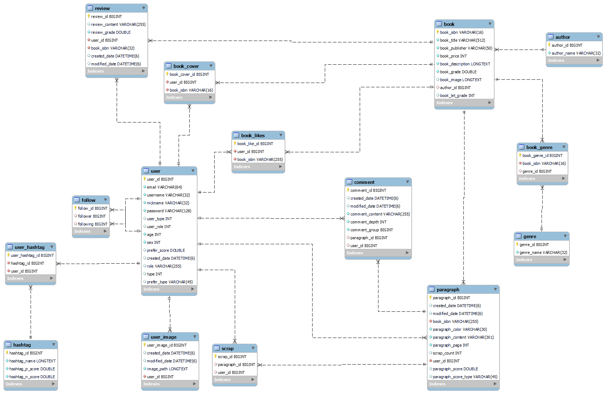
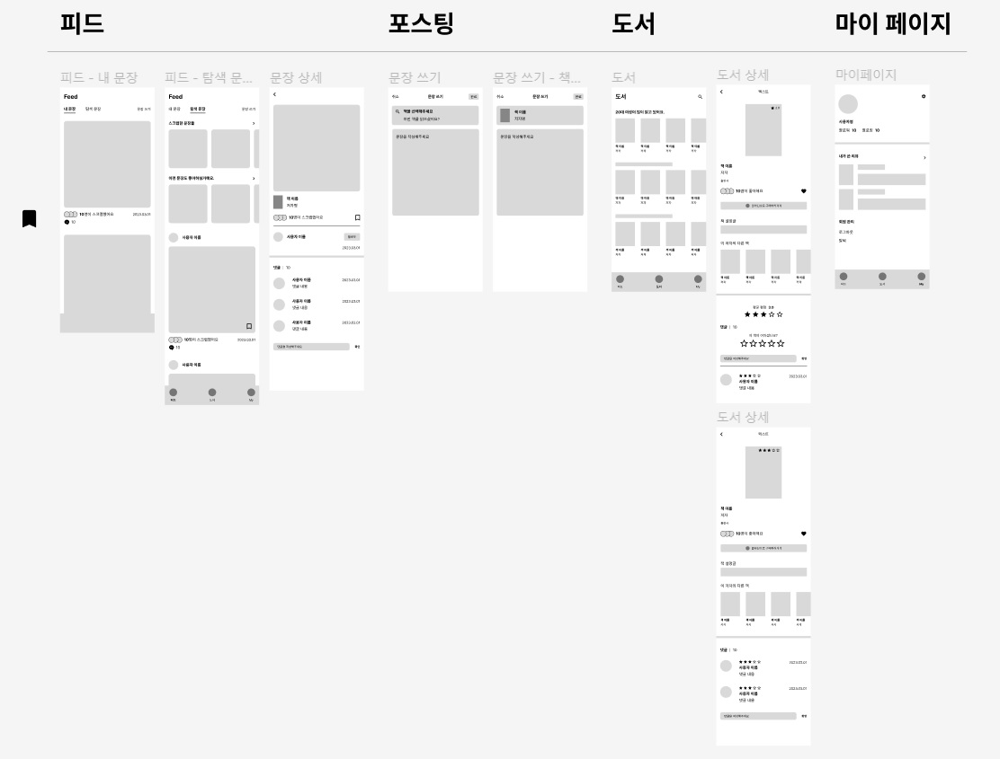
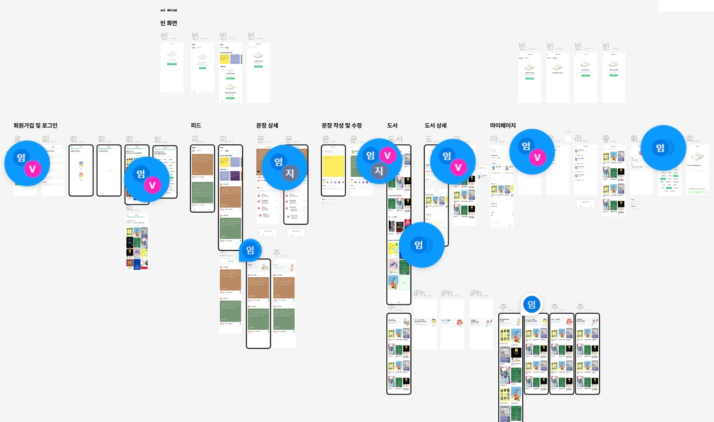
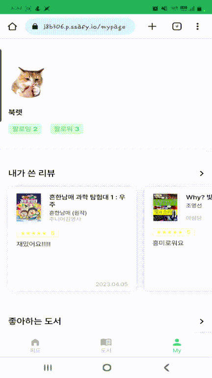
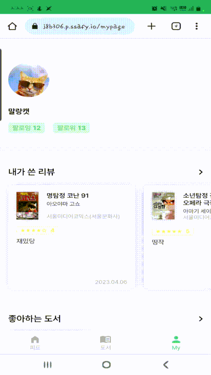

# 프로젝트 소개
## 프로젝트 명
<hr>


## 북렛, 도서 추천 SNS
- 책을 읽다. 문장을 잇다
- Book + roulette의 합성어로 룰렛처럼 사용자에게 꼭 맞는 문장, 책을 추천해준다는 뜻 입니다.
- Book + let의 합성어로 사용자에게 알맞은 책 추천을 해준다는 뜻입니다.
- [북렛 체험하러 가기](https://j8b306.p.ssafy.io/)

## 서비스 특징
- 빅데이터 추천 기술을 활용한 도서, 문장 추천

## 서비스 대상
- 책을 좋아하거나, 마음에 드는 문장 수집을 좋아하는 모든 사람

## 주요 기능
- 회원
- 유저
    - 유저 취향 등록(장르, 책, 감성태그)
    - 팔로우
    - 유저 활동 정보 조회
        - 문장
        - 도서
- 문장
    - 등록/수정/삭제
    - 댓글/대댓글
    - 스크랩
- 도서
    - 도서 리뷰
    - 도서 추천
        - 표지 기반 추천
        - 예상 평점 기반 추천
        - 좋아요 기반 추천
        - 장르 기반 추천
        - 인적사항 기반 추천

 
## 주요 기술
- Spring Security
- JWT Authentication
- REST API
- Keras
- tensorflow
- OpenCV
- KNN & TF-IDF

## 기술 스택
- Frontend
    - React 18.2.0
    - Redux 8.0.5
    - styled-components 5.3.8
    - JavaScript
- Backend
    - Java 11
    - Spring Boot 2.7.9
    - Python 3.9.13, 3.10.10
    - Django 4.0
    - CUDA 11.7
    - keras 2.12.0
    - tensorflow 2.12.0
    - OpenCV 4.7.0.72
    - ipython 9.3.0

- DataBase
    - MySQL 8.0.31
    - S3
- Infra
    - Jenkins 2.387.1
    - Docker 23.0.1
    - springCloudVersion

## 배포 환경
- URL : https://j8b306.p.ssafy.io
- 테스트 계정
    - ID - booklet
    - PW - booklet!
- [포팅 메뉴얼]()

## 진행 일정
- 2023.02.27. ~ 2023.04.07(7주)


## 팀소개 - 북적북적

|김지희|임경민|김성준|송대현|전동준|
|------|------|------|------|------|
| | |  | | |
| 팀장, CI/CD, MSA 아키텍쳐 설계, SNS 및 도서 기본 RestAPI 구현 | FE, 와이어프레임 및 프로토타입 설계, 디자인, FE 전체 기능 구현 | BE, DB parser 및 DB, 로그인, 회원 및 추천 RestAPI | BE, 리뷰 기반 도서추천, 좋아요 기반 도서추천, 유저 정보 기반 도서추천, 카테고리 기반 도서추천, 문장추천 장고서버 담당 | BE, 이미지 분석, 머신러닝, 이미지 분석 장고 서버 담당 |


# 프로젝트 상세 설명
- 북렛은 책을 좋아하여 다양하고 색다른 방법으로 책을 추천 받고 싶거나, 자신만의 소중한 문장들을 다른 사람들과 서로 공유할 수 있는 도서 추천 SNS 플렛폼 입니다.

## 서비스 설명/주요 기능
1. 회원 가입시 감성태그, 선호 책 커버 입력을 통해 추천을 위한 기본 데이터 구축
2. 회원 사용 정보 및 빅데이터 분석, 머신러닝 분석 결과를 활용하여 장르, 좋아요, 평점, 북커버 등 다양한 책 및 문장 추천 
3. 팔로우, 댓글, 스크랩 등 SNS 기능을 도입하여, 유저간 공유하고 소통 가능
4. 마이페이지에서 개인의 활동 내역들을 알 수 있음

## 추천 기술 상세 설명
- [이미지 추천 시스템](RecomendImg.md)
```
# 이미지 추천 시스템 구조

- 1차로 이미지 종류를 분류한 다음, 2차로 동일 카테고리 내에서 유사도가 가장 높은 10개의 이미지 URL 반환

  - 이미지 종류 분류(1차)는 static/model_p1 모델 사용(load_model 시 폴더 째로 불러오기)
  - 이미지 데이터 읽기 및 전처리는 cv2를 사용하였고, 색채 유사성 패턴을 고려하여 컬러 이미지로 처리했습니다.

- 표지 추천 시 최대한 비슷한 요소들을 갖고 있는 이미지를 추천할 수 있도록 추천 모델을 구성했습니다.
```
- 기존 SSIM 모델, yolo 5 등 정밀한 추천을 기획하였으나, 성능측면이 상당히 저하되어, 유저 편익에 해를 가하게 되었고, 이에 따라 keras를 도입하는 등 성능 측면을 향상시켰습니다.

- [기본 추천 시스템](Recomend.md)
    - 협업필터링 with KNN
    - 컨텐츠 기반 필터링 with TF-IDF


## 기획/설계


<hr>

### 아키텍처


### ERD


### 와이어 프레임


### 포로토타입



### 파일 구조
- Frontend
```
C:.
├─build
│  └─static
│      ├─css
│      ├─js
│      └─media
├─node_modules
├─public
└─src
    ├─apis
    │  └─init
    ├─assets
    │  ├─icons
    │  └─images
    │      ├─Banner
    │      └─dummy
    │          └─cover
    ├─components
    │  ├─atoms
    │  │  ├─Button
    │  │  ├─Icon
    │  │  │  └─TabBar
    │  │  ├─Image
    │  │  ├─Join
    │  │  ├─Mypage
    │  │  └─Sentence
    │  ├─molecules
    │  │  ├─Banner
    │  │  ├─Bar
    │  │  ├─Book
    │  │  ├─Input
    │  │  ├─Mypage
    │  │  ├─Sentence
    │  │  └─Tab
    │  ├─organisms
    │  │  ├─Book
    │  │  ├─Join
    │  │  ├─Mypage
    │  │  └─Sentence
    │  ├─pages
    │  │  ├─Book
    │  │  ├─Join
    │  │  ├─Login
    │  │  ├─Mypage
    │  │  └─Sentence
    │  └─templates
    │      └─Book
    ├─config
    ├─fonts
    ├─hooks
    ├─reducer
    └─styles
        ├─Book
        ├─common
        ├─Mypage
        ├─Sentence
        └─User
```

- Backend
- Spring
```
C:\PROJECT\S08P22B306\BE\SPRING\{서비스명}-SERVICE
└─src
    ├─main
    │  ├─java
    │  │  └─com
    │  │      └─booklet
    │  │          └─{서비스명}service
    │  │              ├─config
    │  │              ├─controller
    │  │              ├─dto
    │  │              │  ├─{entity1}
    │  │              │  └─{entity2}
    │  │              ├─entity
    │  │              ├─repository
    │  │              ├─service
    │  │              └─util
    │  └─resources
```

- django

```
recommend-bookcover
 ┣ bookcover
 ┃ ┣ admin.py
 ┃ ┣ apps.py
 ┃ ┣ models.py
 ┃ ┣ serializers.py
 ┃ ┣ tests.py
 ┃ ┣ train.py
 ┃ ┣ urls.py
 ┃ ┣ views.py
 ┃ ┗ __init__.py
 ┣ models
 ┃ ┣ model5
 ┃ ┃ ┣ variables
 ┃ ┃ ┃ ┣ variables.data-00000-of-00001
 ┃ ┃ ┃ ┗ variables.index
 ┃ ┃ ┣ fingerprint.pb
 ┃ ┃ ┣ keras_metadata.pb
 ┃ ┃ ┗ saved_model.pb
 ┃ ┗ model_p1
 ┃ ┃ ┣ assets
 ┃ ┃ ┣ variables
 ┃ ┃ ┃ ┣ variables.data-00000-of-00001
 ┃ ┃ ┃ ┗ variables.index
 ┃ ┃ ┣ fingerprint.pb
 ┃ ┃ ┣ keras_metadata.pb
 ┃ ┃ ┗ saved_model.pb
 ┣ recommend
 ┃ ┣ asgi.py
 ┃ ┣ settings.py
 ┃ ┣ urls.py
 ┃ ┣ wsgi.py
 ┃ ┗ __init__.py
 ┣ .gitignore
 ┣ Dockerfile
 ┣ manage.py
 ┗ requirements.txt
```
```
recommend-service
 ┣ basic_recom
 ┃ ┣ excel
 ┃ ┃ ┣ author_df.xlsx
 ┃ ┃ ┣ book_10_female_data.xlsx
 ┃ ┃ ┣ book_10_male_data.xlsx
 ┃ ┃ ┣ book_20_female_data.xlsx
 ┃ ┃ ┣ book_20_male_data.xlsx
 ┃ ┃ ┣ book_30_female_data.xlsx
 ┃ ┃ ┣ book_30_male_data.xlsx
 ┃ ┃ ┣ book_40_female_data.xlsx
 ┃ ┃ ┣ book_40_male_data.xlsx
 ┃ ┃ ┣ book_50_female_data.xlsx
 ┃ ┃ ┣ book_50_male_data.xlsx
 ┃ ┃ ┣ book_author_df.xlsx
 ┃ ┃ ┣ book_category_df.xlsx
 ┃ ┃ ┣ book_info_df.xlsx
 ┃ ┃ ┣ category_df.xlsx
 ┃ ┃ ┣ df_book.xlsx
 ┃ ┃ ┣ df_star.xlsx
 ┃ ┃ ┗ score_list.csv
 ┃ ┣ admin.py
 ┃ ┣ apps.py
 ┃ ┣ models.py
 ┃ ┣ tests.py
 ┃ ┣ urls.py
 ┃ ┣ views.py
 ┃ ┗ __init__.py
 ┣ book_recom
 ┃ ┣ asgi.py
 ┃ ┣ settings.py
 ┃ ┣ urls.py
 ┃ ┣ wsgi.py
 ┃ ┗ __init__.py
 ┣ .gitignore
 ┣ Dockerfile
 ┣ manage.py
 ┣ README.md
 ┣ requirements.txt
 ┗ start.sh
```

## 서비스 구현 내용
<hr>

### 로그아웃/로그인


### 회원가입


### 피드 페이지


- 문장쓰기


- 내 문장


- 댓글/대댓글


- 도서 디테일


- **탐색문장**


- 문장추천


- 팔로우


- 스크랩


### 도서 페이지


- 유저 정보 기반 추천


- 좋아요, 평점


- 저자의 다른 책

- 장르 추천


- 좋아요 추천


- 평점기반 추천


- 표지기반 추천


### 마이 페이지


- 팔로우


- 내가쓴 리뷰


- 좋아하는 도서


- 회원 정보 수정

