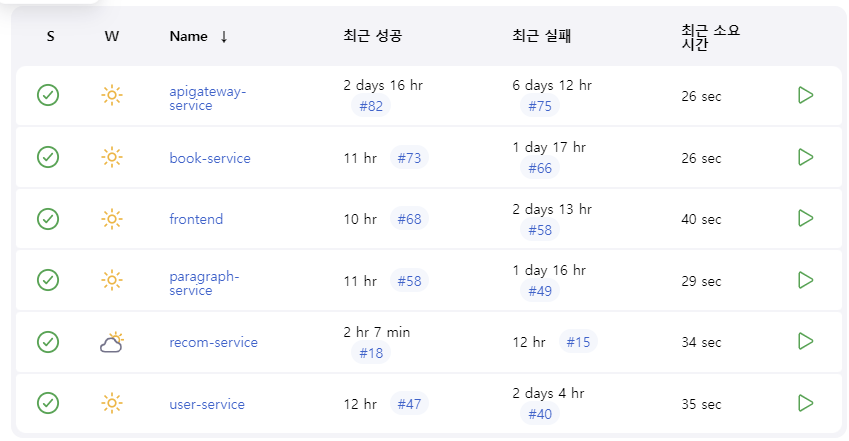
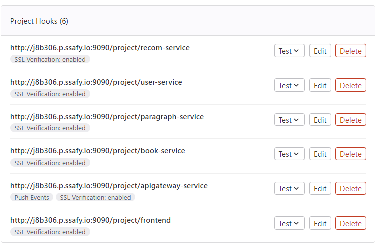
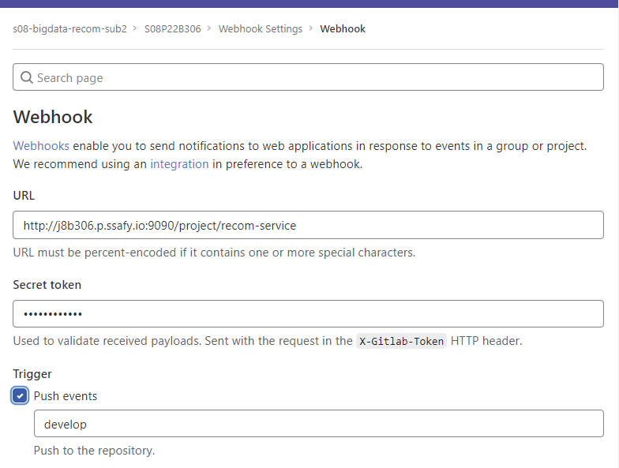
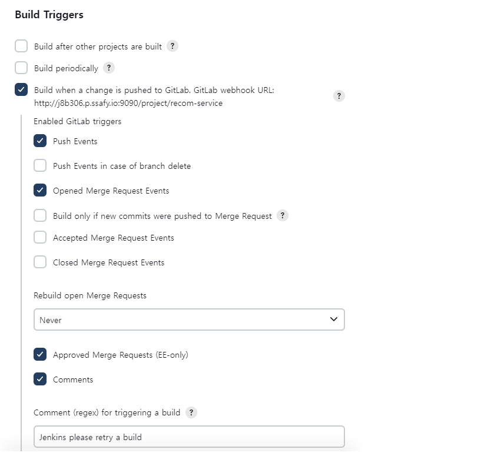
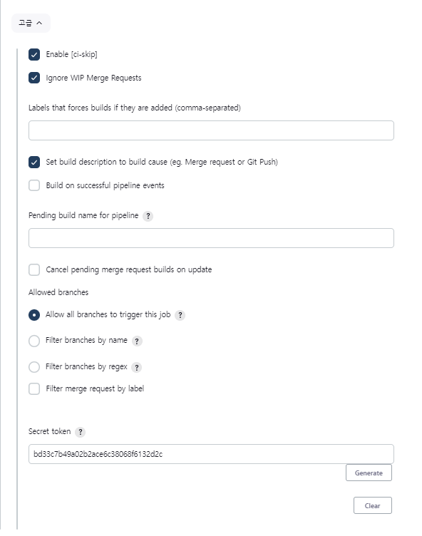

# 포팅 메뉴얼

## Port Number

| Port | 이름 |
| --- | --- |
| 80 | HTTP |
| 443 | HTTPS |
| 3000 | React |
| 8000 | Spring Gate Way |
| 8083 | Django 기본 추천 서버 |
| 8084 | Django 표지 추천 서버 |
| 9090 | Jenkins |
| 3306 | MySQL |

### 프로젝트 사용 도구

| 이슈관리 | JIRA |
| --- | --- |
| 형상관리 | GitLab |
| 커뮤니케이션 | MatterMost, Discord |
| 디자인 | Figma |
| UCC | Movavi |
| CI/CD | Docker, Jenkins |

## 기술 스택

### FrontEnd

| React 18.2.0 |
| --- |
| Redux 8.0.5 |
| styled-componets 5.3.8 |
| Javascript |

### DB

| MySQL 8.0 |
| --- |

### OS

| Ubuntu |
| --- |
| Docker 23.0.1 |
| Jenkins |

### BackEnd

| IntelliJ |
| --- |
| Spring Boot 2.7.9 |
| Spring Cloud 2021.0.6 |
| Eureka |
| Java 11-jdk |
| Gradle |
| Spring Data JPA |
| Swagger 3.0 |
| Spring Security |
| Lombok |
| Django |

### S3 Bucket 설정
```authservice/application.yml
cloud:
  aws:
    s3:
      bucket: {bucket name}
    stack.auto: false
    region.static: ap-northeast-2
    credentials:
      accessKey: {s3-accessKey}
      secretKey: {s3-secretKey}
```

### 랜덤포트를 위한 백엔드 프로젝트 eureka 환경 설정

```docker
eureka:
  client:
    register-with-eureka: true
    fetch-registry: true
    service-url:
      defaultZone: http://j8b306.p.ssafy.io:8761/eureka
```

## Paragaraph / application.yml

```docker
server:
  port: 0 # random port를 사용할 것이기 때문에

spring:
  application:
    name: paragraph-service # eureka yml에 있는 이름과 맞춰야 함.
  jpa:
    hibernate:
      ddl-auto:  update
    properties:
      hibernate:
        # show_sql: true
        format_sql: true
  datasource:
    driver-class-name: com.mysql.cj.jdbc.Driver
    url: jdbc:mysql://j8b306.p.ssafy.io:3306/booklet_db?serverTimezone=UTC&characterEncoding=UTF-8
    username: booklet
    password: qnrwjrqnrwjr!qnrfpt

eureka:
  instance:
    instance-id: ${spring.application.name}:${spring.application.instance_id:${random.value}}
  client:
    register-with-eureka: true
    fetch-registry: true
    service-url:
      defaultZone: http://j8b306.p.ssafy.io/eureka
```

### APIGATEWAY.YAML

```docker
server:
  port: 8000

eureka:
  client:
    register-with-eureka: true
    fetch-registry: true
    service-url:
      defaultZone: http://j8b306.p.ssafy.io:8761/eureka
spring:
  application:
    name: apigateway-service
  cloud:
    gateway:
      default-filters:
        - name: GlobalFilter
          args:
            baseMessage: Spring Cloud Gateway Global Filter
            preLogger: true
            postLogger: true
      routes:
        - id: booklet-paragraph-service
          # uri: http://j8b306.p.ssafy.io:8081/ # 이동될 주소
          uri: lb://PARAGRAPH-SERVICE
          predicates:
            - Path=/booklet-paragraph-service/**
          filters:
            #            - AddRequestHeader=first-request, first-request-header2 # key, value
            #            - AddResponseHeader=first-response, first-response-header2 # key, value
            - CustomFilter
        - id: second-service
          uri: lb://MY-SECOND-SERVICE
          predicates:
            - Path=/second-service/**
          filters:
            #            - AddRequestHeader=second-request, second-request-header2 # key, value
            #            - AddResponseHeader=second-response, second-response-header2 # key, value
            - name: CustomFilter
            - name: LoggingFilter
              args:
                baseMessage: Hi, there.
                preLogger: true
                postLogger: true
```

## **How To Run in Local**

- FrontEnd

```bash
# Node Package Manager 설치
npm install
# 실행
npm start
```

- Backend
    1. discovery-service  Eureka 서버 실행
    2. apigateway-service  게이트 웨이 실행 (8000 포트로 모아주는 역할)
    3. {서비스명}-service  각 기능 프로젝트 실행
    

## **How To Run in EC2**

### 1. Nginx 설치

```bash
# Nginx 설치
sudo apt-get install nginx
# 설치 확인
sudo nginx -v
# Nginx 중지
sudo systemctl stop nginx
```

### 2. SSL 인증서 발급

```bash
# Let's Encrypt 설치
sudo apt-get install letsencrypt
# 인증서 적용 및 .pem 키 발급
sudo letsencrypt certonly --standalone -d [도메인]
# 발급 경로 확인
cd /etc/letsencrypt/live/[도메인]
```

### 3. Docker 설치

- 공식 문서 [https://docs.docker.com/engine/install/ubuntu/](https://docs.docker.com/engine/install/ubuntu/)

```bash
sudo apt-get remove docker docker-engine docker.io containerd runc

sudo apt-get update

sudo apt-get install \
    ca-certificates \
    curl \
    gnupg \
    lsb-release

sudo mkdir -m 0755 -p /etc/apt/keyrings

curl -fsSL https://download.docker.com/linux/ubuntu/gpg | sudo gpg --dearmor -o /etc/apt/keyrings/docker.gpg

echo \
  "deb [arch=$(dpkg --print-architecture) signed-by=/etc/apt/keyrings/docker.gpg] https://download.docker.com/linux/ubuntu \
  $(lsb_release -cs) stable" | sudo tee /etc/apt/sources.list.d/docker.list > /dev/null

sudo apt-get update

sudo apt-get install docker-ce docker-ce-cli containerd.io docker-buildx-plugin docker-compose-plugin
```

### 4. MySQL 설치

```bash
# EC2 서버 업데이트 진행
sudo apt update
# MySQL 설치
sudo apt install mysql-server
# MySQL 상태 확인
sudo systemctl status mysql
# root 계정 접속
sudo mysql -u root -p
```

```bash
# 외부 접속 허용
# bind-address = 0.0.0.0
sudo vi /etc/mysql/mysql.conf.d/mysqld.cnf
# MySQL 재실행
sudo service mysql restart
```

### 5. 방화벽 설정

```bash
# ufw 활성화
sudo ufw enabled
# ufw 상태 확인
sudo ufw status
# ufw 허용
sudo ufw allow ssh
sudo ufw allow [포트번호]
```

### 6. Nginx 설정

```bash
# 설정 파일 위치로 이동
cd /etc/nginx/sites-available
# conf 파일 생성
sudo vim [파일명].conf
# 파일 연동 및 테스트
sudo ln -s /etc/nginx/sites-available/[파일명].conf /etc/nginx/sites-enabled/[파일명].conf
sudo nginx -t
# Nginx 재시작
sudo systemctl restart nginx
# Nginx 상태 확인
sudo systemctl status nginx
```

```bash
server {
        # 프론트 연결(포트 번호는 본인의 프론트 포트번호를 입력)
        location / {
                proxy_pass http://localhost:3000;
                proxy_set_header Host $host;
                proxy_set_header X-Real-IP $remote_addr;

                proxy_buffer_size       128k;
                proxy_buffers           4 256k;
                proxy_busy_buffers_size 256k;
                
                proxy_connect_timeout 300s;
                proxy_send_timeout 300s;
                proxy_read_timeout 300s;
                send_timeout 300s;
        }

        # 백엔드 연결(포트 번호는 본인의 백엔드 포트번호를 입력)
        location /api {
                proxy_connect_timeout   90; # default 60
                proxy_send_timeout      90; # default 60
                proxy_read_timeout      300; 

                proxy_pass https://localhost:8000/api;
       
        }
        location /basic_recom {
                proxy_pass http://localhost:8083/basic_recom;
                
        }
        location /cover_recom {
                proxy_pass http://localhost:8084/cover_recom;
        }
        listen 443 ssl; # managed by Certbot
        # 도메인 이름을 써줘야함
        ssl_certificate /etc/letsencrypt/live/[도메인]/fullchain.pem; # managed by Certbot
        # 도메인 이름을 써줘야함
        ssl_certificate_key /etc/letsencrypt/live/[도메인]/privkey.pem; # managed by Certbot
        # include /etc/letsencrypt/options-ssl-nginx.conf; # managed by Certbot
        # ssl_dhparam /etc/letsencrypt/ssl-dhparams.pem; # managed by Certbot
}

server {
        # 도메인 이름을 입력
        if ($host = [도메인]) {
                return 301 https://$host$request_uri;
        } # managed by Certbot

        listen 80;
        server_name [도메인];
        return 404; # managed by Certbot
}
```

### 7. Dockerfile 및 nginx.conf 작성

- Frontend

```docker
FROM nginx:stable-alpine
WORKDIR /app
RUN mkdir ./build
ADD ./build ./build
RUN rm /etc/nginx/conf.d/default.conf
COPY ./nginx.conf /etc/nginx/conf.d
EXPOSE 3000
CMD [ "nginx","-g", "daemon off;" ]
```

```bash
server {
    listen 443;
    location / {
        root /app/build;
        index index.html;
        try_files $uri $uri/ /index.html;
    }
}
```

- Backend-Spring

```docker
FROM openjdk:11-jdk-slim
ARG JAR_FILE=build/libs/*.jar
COPY ${JAR_FILE} app.jar
ENTRYPOINT ["java" , "-jar", "/app.jar"]
```

모든 프로젝트마다 작성

- Backend-Django

```docker
# # BE/Dockerfile (Django)
FROM python:3.8.10
ENV PYTHONUNBUFFERED 1
RUN apt-get -y update
RUN apt-get -y install vim 
RUN mkdir /srv/docker-server
ADD . /srv/docker-server 
WORKDIR /srv/docker-server 
RUN pip3 install --upgrade pip 
RUN pip3 install -r requirements.txt 
EXPOSE 8083
CMD ["python", "manage.py", "runserver", "0.0.0.0:8083"]
```

### 8. Docker로 유레카 서버 및 서버 수동 배포

# Docker Network 설정

### 1. booklet-network 네트워크 생성

```bash
docker network create --gateway 172.18.0.1 --subnet 172.18.0.0/16 booklet-network
```

# Docker Container 실행

### 1. docker image ec2 서버로 pull

```bash
sudo docker pull cjg05034/book-let:paragraph-service
sudo docker pull cjg05034/book-let:frontend-image
sudo docker pull cjg05034/book-let:apigateway-service
sudo docker pull cjg05034/book-let:paragraph-service
```

### 2. docker 컨테이너 실행

```bash
docker run --rm -d --network {도커 네트워크 이름} -e "eureka.client.serviceUrl.defaultZone=http://discovery-service:8761/eureka/" --name {원하는 이름} {이미지 ID}
```

```bash
# 유레카 서버
docker run --rm -d --network {도커 네트워크 이름} --name {원하는 이름} {이미지 ID}
docker run --rm -d -p 8761:8761 --network booklet-network --name discovery-service cedc13a461c8

docker run -d -p 8761:8761 --network booklet-network 

 --name discovery-service edowon0623/discovery-service
```

```bash
# paragraph service
docker run --rm -d --network booklet-network -e "eureka.client.serviceUrl.defaultZone=http://discovery-service:8761/eureka/" --name paragraph-service b0ba25d889ef

docker run --rm -d -p 8001:8001 --network booklet-network -e "eureka.client.serviceUrl.defaultZone=http://discovery-service:8761/eureka/" --name apigateway-service bd43fcee4886

docker run --rm -d -p 3000:443--network booklet-network --name frontend-image 4e6e1978e59f
```

### 9. Jenkins 설치

```bash
# jenkins 설치
sudo docker pull jenkins/jenkins:lts
# jenkins 컨테이너 실행
sudo docker run -d -p 9999:9090-v /home/ubuntu/jenkins:/var/jenkins_home --name jenkins -u root jenkins/jenkins:lts
# jenkins 컨테이너 접속
sudo docker exec -it jenkins bash
# docker 설치 (3. Docker 설치 참고)
# npm 설치
apt install npm
```

### 10. Jenkins Pipeline 작성

- Frontend

```bash
pipeline {
    agent any
    tools {
        nodejs "NodeJS 19.8.1"
        git "git"
    }
 
 environment {
     GIT_URL = "https://lab.ssafy.com/s08-bigdata-recom-sub2/S08P22B306.git"
 }
 
 stages {
     stage('Pull') {
         steps {
             script {
                 git url: "${GIT_URL}", branch: "develop", credentialsId: 'cjg05034@naver.com', poll: true, changelog: true
             }
         }
     }
     stage('copy env') {
         steps {
             script {
                 sh 'cp /home/ubuntu/application/.env /var/lib/jenkins/workspace/frontend/FE/.env'

             }
         }
     }
     stage('React Build') {
         steps {
             dir('FE'){
             sh 'npm install -g yarn'
             sh 'yarn --cwd ./FE install --network-timeout 100000'
             sh 'CI=false yarn build'
             }
         }
     }
     
     stage('Build') {
         steps {
             script {
                 sh 'docker build -t react-deploy ./FE'
             }
         }
     }
   
   stage('Deploy') {
       steps {
           script {
               try {
                   sh 'docker stop react-deploy && docker rm react-deploy'
               } catch(Exception e) {
                   echo e.getMessage()
                   echo "Error detected, but we will continue."
               }
               
               sh 'docker run -d --name react-deploy -p 3000:443 -v /etc/letsencrypt/archive:/etc/letsencrypt/archive -u root react-deploy'
           }
       }
   }
   
   stage('Finish') {
       steps {
           script {
               sh 'docker images -qf dangling=true | xargs -I{} docker rmi {}'
           }
       }
   }
 }
}
```

- Backend

서버 재가동 시, apigateway에서 로드 밸런싱이 안 이뤄지는 이슈 발생 

→ discoveryservice(eureka) 서버 재가동 후 서버 실행

`sh 'docker restart discovery-service` 

```jsx
pipeline {
    agent any
 
 environment {
     GIT_URL = "https://lab.ssafy.com/s08-bigdata-recom-sub2/S08P22B306.git"
 }
 
 stages {
     stage('Pull') {
         steps {
             script {
                 git url: "${GIT_URL}", branch: "develop", credentialsId: 'cjg05034@naver.com', poll: true, changelog: true
             }
         }
     }
   
   stage('SpringBoot Build') {
       steps {
           script {
               dir('BE/spring/{서비스명}-service') {
                   sh 'chmod +x ./gradlew'
                   sh './gradlew clean build -x test'
                   sh 'docker build -t {서비스명}-deploy .'
               }
           }
       }
   }
   
   stage('Deploy') {
       steps {
           script {
               try {
                   sh 'docker stop {서비스명}-deploy && docker rm {서비스명}-deploy'
               } catch(Exception e) {
                   echo e.getMessage()
                   echo "Error detected, but we will continue."
               }
               sh 'docker restart discovery-service'
               sh 'docker run -d --network booklet-network -e "eureka.client.serviceUrl.defaultZone=http://discovery-service:8761/eureka/" --name book-deploy {서비스명}-deploy'
            //   sh 'docker run --name book-deploy -d -u root {서비스명}-deploy'
           }
       }
   }
   
   stage('Finish') {
       steps {
           script {
               sh 'docker images -qf dangling=true | xargs -I{} docker rmi {}'
           }
       }
   }  
 }
}
```



### 11. Gitlab Webhook

- Gitlab repository에 push evets(Merge request events) 발생 시, 젠킨스에서 설정 프로젝트 자동 빌드 수행하도록 설정





- Jenkins   trigger 설정





생성한 토큰을 깃랩 웹훅에 등록
